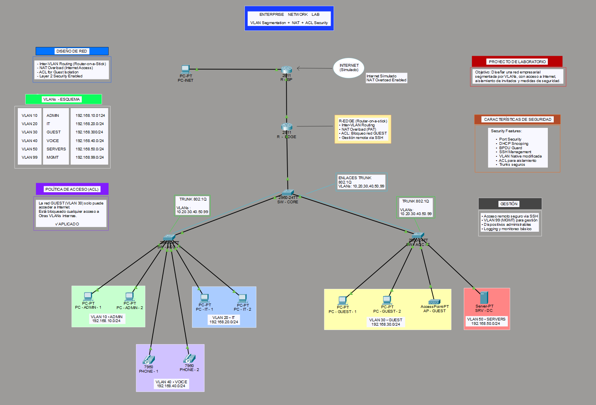

# Enterprise-Network-Lab

Enterprise network simulation with VLANs, NAT and ACL security.

---

## 📡 Network Topology

---

## 🧠 Project Overview

This project simulates a small enterprise network using Cisco Packet Tracer.  
It includes segmentation, routing, and basic security features.

---

## ⚙️ Technologies Used

- VLANs (10 ADMIN, 20 IT, 30 GUEST, 40 VOICE, 50 SERVERS, 99 MGMT)
- Inter-VLAN Routing (Router-on-a-Stick)
- DHCP Configuration
- NAT (Internet access)
- ACL (basic filtering)
- Layer 2 Switching (Trunking, STP)

---

## 🌐 Network Design

- Core switch connected to access switches
- Router acting as gateway for all VLANs
- Server in VLAN 50 (192.168.50.10)
- End devices segmented by department

---

## 🔍 Connectivity Tests

✔ Successful ping between VLANs  
✔ Internet access working (NAT configured)  
✔ Server reachable from authorized networks  

---

## ⚠️ Troubleshooting Performed

- Fixed trunk VLAN mismatch  
- Verified VLAN creation and assignment  
- Checked default gateway configuration  
- Validated routing between VLANs  

---

## 📁 Files Included

- `Jayro_Leon_Enterprise_Network_Project.pkt`
- `diagram_overview.png`
- `diagram_detail.png`

---

## 🚀 Author

Jayro Leon  
CCST Networking & Cybersecurity  
